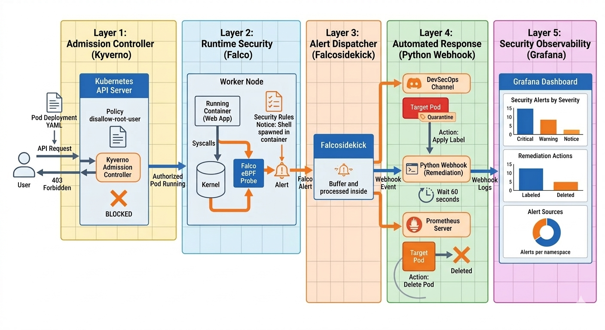

# 🛡️ k8s-runtime-security — Kubernetes Runtime Threat Detection

> ***A fully automated Kubernetes security pipeline using Falco, Kyverno and a custom Python webhook. Detects runtime threats at the syscall level, routes alerts to Discord, quarantines compromised pods and enforces admission policies — all running on a local minikube cluster.***

[](https://falco.org)
[](https://kubernetes.io)
[](https://python.org)
[](https://kyverno.io)
[](https://prometheus.io)
[](https://discord.com)
[](./LICENSE)

---

## 🎯 What is this project?

This project implements Kubernetes runtime security pipeline entirely on a local minikube cluster — no cloud infrastructure required. It covers the full threat detection and response lifecycle from kernel-level syscall detection to automated pod quarantine and deletion.

🔍 **Detects** runtime threats using Falco with 8 custom rules mapped to the MITRE ATT&CK framework  
⚡ **Responds** automatically — quarantines pods instantly, deletes them after a 60-second forensics window  
🚫 **Prevents** dangerous containers from starting using Kyverno admission policies  
🔔 **Notifies** in real-time via Discord with structured alert embeds  
📊 **Visualises** alert metrics in a live Grafana dashboard  
🐍 **Automates** response with a custom Python webhook (Flask + Kubernetes client)

---

## 🏗️ Architecture



### Security Layers

| Layer | Tool | Purpose |
|---|---|---|
| Prevention | Kyverno | Block privileged containers, `:latest` tags at admission |
| Detection | Falco 0.43 + modern eBPF | Runtime syscall monitoring — 8 custom rules |
| Routing | Falcosidekick | Fan-out alerts → Discord + webhook + Prometheus |
| Response | Python webhook (Flask + k8s client) | Quarantine instantly → delete after 60s |
| Observability | Prometheus + Grafana | Live alert metrics dashboard |

---

## ⚡ Tech Stack

| Component | Tool | Version |
|---|---|---|
| Container Orchestration | Kubernetes (minikube) | 1.35.1 |
| Runtime Detection | Falco | 0.43.0 |
| Alert Routing | Falcosidekick | 2.32.0 |
| Admission Control | Kyverno | 1.17.1 |
| Response Webhook | Python + Flask | 3.12 / 3.1.0 |
| K8s Client | kubernetes-python | 31.0.0 |
| Metrics | Prometheus + Grafana | kube-prometheus-stack |
| Notifications | Discord Webhooks | — |
| Package Manager | Helm | 3.20.1 |
| Host OS | Ubuntu | 24.04 |

---

## 🔐 Falco Detection Rules

8 custom rules mapped to MITRE ATT&CK:

| Rule | Priority | MITRE Tactic | Trigger |
|---|---|---|---|
| Terminal shell in container | CRITICAL | Execution (T1059) | bash/sh/zsh spawned |
| Sensitive file read | CRITICAL | Credential Access (T1555) | /etc/shadow, SSH keys |
| Write binary directory | CRITICAL | Persistence (T1574) | Write to /usr/bin |
| Netcat or nmap in container | CRITICAL | Discovery (T1046) | nc, nmap, socat |
| Privilege escalation via sudo | WARNING | Privilege Escalation | sudo executed |
| Package manager in container | WARNING | Defense Evasion | apt, yum, pip |
| Unexpected outbound connection | WARNING | C2 (T1071) | Non-standard port |
| Container running as root | WARNING | Privilege Escalation | UID 0 process |

---

## 🚀 Installation — From Scratch

> ⚠️ **Important:** Run **all commands from the project root** (`k8s-runtime-security/`) unless stated otherwise. Running `helm` or `kubectl` commands from inside subfolders will cause `no such file or directory` errors.

---

### Step 0 — Clone the Github Repo

```bash
git clone https://github.com/charan-s108/k8s-runtime-security.git
```

---

### Step 1 — Install prerequisites

**Docker:**
```bash
sudo apt update
sudo apt install -y docker.io
sudo usermod -aG docker $USER
newgrp docker
docker run hello-world
```

**minikube:**
```bash
curl -LO https://storage.googleapis.com/minikube/releases/latest/minikube-linux-amd64
sudo install minikube-linux-amd64 /usr/local/bin/minikube
minikube version
```

**kubectl:**
```bash
curl -LO "https://dl.k8s.io/release/$(curl -L -s https://dl.k8s.io/release/stable.txt)/bin/linux/amd64/kubectl"
sudo install -o root -g root -m 0755 kubectl /usr/local/bin/kubectl
kubectl version --client
```

**Helm:**
```bash
curl https://raw.githubusercontent.com/helm/helm/main/scripts/get-helm-3 | bash
helm version
```

---

### Step 2 — Start minikube

```bash
minikube start --memory=5120 --cpus=4 --driver=docker
kubectl get nodes
# Expected: minikube   Ready   control-plane
```

---

### Step 3 — Set your Discord webhook URL

Before deploying, you need a Discord webhook URL.
👉 See **[docs/discord-setup.md](docs/discord-setup.md)** for full step-by-step instructions.

Once you have the URL, open `falco/values.yaml` and replace the placeholder:

```bash
nano falco/values.yaml
```

Find and update this line:
```yaml
    discord:
      webhookurl: "REPLACE_WITH_YOUR_DISCORD_WEBHOOK_URL"
```

Save: `Ctrl+O` → `Enter` → `Ctrl+X`

---

### Step 4 — Deploy Falco with custom rules

```bash
# Add Helm repo
helm repo add falcosecurity https://falcosecurity.github.io/charts
helm repo update

# Create namespace
kubectl create namespace falco

# Create ConfigMap from custom rules file
kubectl create configmap falco-custom-rules \
  --from-file=custom-rules.yaml=falco/custom-rules.yaml \
  -n falco

# Verify ConfigMap was created
kubectl get configmap falco-custom-rules -n falco

# Install Falco with default settings first
helm install falco falcosecurity/falco -n falco

# Wait for default pod to be Running
kubectl get pods -n falco -w
# Wait for: falco-xxxxx   2/2   Running  — then Ctrl+C

# Upgrade with your custom values (rules + Falcosidekick + Discord)
helm upgrade falco falcosecurity/falco -n falco -f falco/values.yaml

# Watch pods restart
kubectl get pods -n falco -w
# Wait for: falco-xxxxx   2/2   Running  — then Ctrl+C
```

Verify custom rules loaded with no errors:
```bash
FALCO_POD=$(kubectl get pod -n falco -l app.kubernetes.io/name=falco \
  -o jsonpath='{.items[0].metadata.name}')

kubectl logs $FALCO_POD -n falco -c falco | grep -A5 "Loading rules"
# Expected — two lines, zero errors:
# Loading rules from:
#    /etc/falco/falco_rules.yaml | schema validation: ok
#    /etc/falco/rules.d/custom-rules.yaml | schema validation: ok
```

---

### Step 5 — Build and deploy the webhook

```bash
# Point Docker CLI at minikube's internal registry
eval $(minikube docker-env)

# Build webhook image inside minikube
docker build -t webhook-server:latest webhook/

# Verify image is present
docker images | grep webhook

# Deploy all webhook resources (namespace, RBAC, deployment, service)
kubectl apply -f k8s/webhook-deploy.yaml

# Watch pod come up
kubectl get pods -n webhook -w
# Wait for: webhook-server-xxxxx   1/1   Running  — then Ctrl+C

# Verify webhook is healthy
kubectl logs -l app=webhook-server -n webhook
# Expected: * Running on http://0.0.0.0:5000
```

---

### Step 6 — Run webhook tests

```bash
cd webhook
python3 -m venv venv
source venv/bin/activate
pip install -r requirements.txt
python3 -m pytest tests/test_webhook.py -v
deactivate
cd ..
```

Expected:
```
tests/test_webhook.py::test_health                      PASSED
tests/test_webhook.py::test_critical_alert_actioned     PASSED
tests/test_webhook.py::test_warning_alert_actioned      PASSED
tests/test_webhook.py::test_no_pod_metadata_ignored     PASSED
tests/test_webhook.py::test_non_security_rule_ignored   PASSED
tests/test_webhook.py::test_rate_limiting               PASSED

6 passed in 0.64s
```

---

### Step 7 — Deploy Kyverno admission policies

```bash
helm repo add kyverno https://kyverno.github.io/kyverno/
helm repo update

helm install kyverno kyverno/kyverno -n kyverno --create-namespace

# Wait for all 4 Kyverno pods — takes ~60 seconds
kubectl get pods -n kyverno -w
# Wait for all 4 pods: Running  — then Ctrl+C

# Apply admission policies
kubectl apply -f kyverno/admission-policies.yaml

# Verify policies are ready
kubectl get clusterpolicy
# Expected: all 3 policies READY: True

# Test — this should be DENIED
kubectl run test-latest --image=nginx:latest --restart=Never
# Expected: Error from server: admission webhook denied the request

# Clean up test pod attempt
kubectl delete pod test-latest --ignore-not-found
```

---

### Step 8 — Deploy Prometheus + Grafana

```bash
helm repo add prometheus-community https://prometheus-community.github.io/helm-charts
helm repo update

helm install prometheus prometheus-community/kube-prometheus-stack \
  --namespace monitoring \
  --create-namespace \
  --set grafana.adminPassword=admin123 \
  --set prometheus.prometheusSpec.serviceMonitorSelectorNilUsesHelmValues=false

# Watch pods — takes 2-3 minutes
kubectl get pods -n monitoring -w
# Wait for all pods: Running  — then Ctrl+C

# Apply Falco ServiceMonitor
kubectl apply -f monitoring/falco-servicemonitor.yaml

# Start Grafana
kubectl port-forward svc/prometheus-grafana -n monitoring 3000:80 &
# Open: http://localhost:3000
# Login: admin / admin123
```

**Grafana dashboard queries** — add these as panels:
```promql
# Alerts by rule (Bar chart)
sum by (rule) (falcosecurity_falcosidekick_falco_events_total)

# Alerts by severity (Pie chart)
sum by (priority_raw) (falcosecurity_falcosidekick_falco_events_total)

# Alerts by namespace (Bar chart)
sum by (k8s_ns_name) (falcosecurity_falcosidekick_falco_events_total{k8s_ns_name!=""})

# Discord delivery count (Stat)
falcosecurity_falcosidekick_outputs_total{destination="discord",status="ok"}
```

Save as **Falco Security Dashboard**.

---

### Step 9 — Verify the complete stack

```bash
kubectl get pods -A | grep -v "kube-system"
```

All pods must show `Running`. If any are not ready, check the relevant troubleshooting section below.

---

## 🔴 End-to-End Attack Simulation

Open 3 terminals side by side.

**Terminal 1 — Live webhook response:**
```bash
kubectl logs -l app=webhook-server -n webhook -f
```

**Terminal 2 — Pod watch:**
```bash
kubectl get pods -w
```

**Terminal 3 — Launch attacker and attack:**
```bash
# Must use pinned tag — Kyverno blocks :latest
kubectl run attacker --image=ubuntu:22.04 --restart=Never -- sleep 3600
kubectl wait --for=condition=Ready pod/attacker --timeout=30s

# Exec into pod — triggers: Terminal shell in container (CRITICAL)
kubectl exec -it attacker -- /bin/bash
```

Inside the shell:
```bash
cat /etc/shadow    # triggers: Sensitive file read (CRITICAL)
apt-get update     # triggers: Package manager in container (WARNING)
exit
```

**Expected Terminal 1 sequence:**
```
Alert received: rule='Terminal shell in container' priority=Critical pod=attacker ns=default
RESPONDING to rule='Terminal shell in container' priority=CRITICAL pod=attacker ns=default
QUARANTINED pod=attacker ns=default — network isolated
Pod attacker will be deleted in 60 seconds
...
Forensics window elapsed — deleting pod=attacker
DELETED pod=attacker ns=default
```

**After 60 seconds:**
```bash
kubectl get pod attacker
# Error from server (NotFound): pods "attacker" not found ✓
```

---

## ⏹️ Stopping the Project

```bash
# Kill Grafana port-forward
kill $(lsof -t -i:3000) 2>/dev/null

# Stop minikube — all deployments persist for next start
minikube stop
```

---

## ▶️ Restarting After a Stop

```bash
# 1. Start cluster
minikube start --memory=5120 --cpus=4 --driver=docker

# 2. Rebuild webhook image — required after every minikube restart
eval $(minikube docker-env)
docker build -t webhook-server:latest webhook/
kubectl rollout restart deployment/webhook-server -n webhook

# 3. Verify stack
kubectl get pods -A | grep -v "kube-system"

# 4. Restart Grafana
kubectl port-forward svc/prometheus-grafana -n monitoring 3000:80 &
```

> **Why rebuild?** minikube does not persist locally-built Docker images across restarts. All Helm releases and Kubernetes manifests persist automatically.

---

## 🗑️ Full Teardown

Removes everything cleanly — Helm releases, namespaces, repos and the cluster:

```bash
# Uninstall Helm releases
helm uninstall falco -n falco
helm uninstall kyverno -n kyverno
helm uninstall prometheus -n monitoring

# Remove Kubernetes resources
kubectl delete -f k8s/webhook-deploy.yaml
kubectl delete -f kyverno/admission-policies.yaml
kubectl delete -f monitoring/falco-servicemonitor.yaml

# Delete namespaces
kubectl delete namespace falco webhook kyverno monitoring

# Remove Helm repos and cached packages
helm repo remove falcosecurity
helm repo remove kyverno
helm repo remove prometheus-community
helm repo update

# Delete minikube cluster and all cached data
minikube delete
rm -rf ~/.minikube
```

---

## 🔧 Troubleshooting

### `no such file or directory` on helm commands
Always run from the project root, never from inside subfolders:
```bash
pwd  # must show .../k8s-runtime-security
helm upgrade falco falcosecurity/falco -n falco -f falco/values.yaml
```

### Falco pod in CrashLoopBackOff
```bash
FALCO_POD=$(kubectl get pod -n falco -l app.kubernetes.io/name=falco \
  -o jsonpath='{.items[0].metadata.name}')
kubectl logs $FALCO_POD -n falco -c falco
# Read the exact error — usually a rule syntax issue in values.yaml
helm upgrade falco falcosecurity/falco -n falco -f falco/values.yaml
```

### Webhook pod shows ErrImageNeverPull
```bash
# Image lost after minikube restart — rebuild
eval $(minikube docker-env)
docker build -t webhook-server:latest webhook/
kubectl rollout restart deployment/webhook-server -n webhook
```

### No alerts reaching webhook
```bash
kubectl logs -l app.kubernetes.io/name=falcosidekick -n falco --tail=20
# Look for: Webhook - POST OK (200)
# If missing, verify webhook service address in falco/values.yaml:
# webhook.address: "http://webhook-service.webhook.svc.cluster.local:5000"
```

### Grafana shows no data
```bash
# Check Falcosidekick metrics are being scraped
kubectl port-forward svc/falco-falcosidekick -n falco 2801:2801 &
curl -s http://localhost:2801/metrics | grep falcosecurity
# Use exact metric name: falcosecurity_falcosidekick_falco_events_total
```

### Kyverno policies not blocking
```bash
kubectl get clusterpolicy
# All 3 must show READY: True
# If not, wait 60s — Kyverno initialises slowly on first install
```

---

## 🔗 References

- [Falco Documentation](https://falco.org/docs/)
- [Falcosidekick](https://github.com/falcosecurity/falcosidekick)
- [Kyverno Documentation](https://kyverno.io/docs/)
- [kubernetes-python client](https://github.com/kubernetes-client/python)
- [kube-prometheus-stack](https://github.com/prometheus-community/helm-charts/tree/main/charts/kube-prometheus-stack)
- [MITRE ATT&CK — Containers Matrix](https://attack.mitre.org/matrices/enterprise/containers/)
- [Discord Webhook Setup Guide](docs/discord-setup.md)

---

## 📝 License

This project is licensed under the **MIT License** — see [LICENSE](./LICENSE) for details.

---

## 👨‍💻 Author

**Charan**  
🔗 [GitHub](https://github.com/charan-s108) | 💼 [LinkedIn](https://linkedin.com/in/charan-s108) | 📧 [charansrinivas108@gmail.com](mailto:charansrinivas108@gmail.com)

---

### 🎉 Built with ❤️ for the Cybersecurity Community

[](https://github.com/charan-s108/k8s-runtime-security)

⭐ If this helped you, consider giving it a star!
